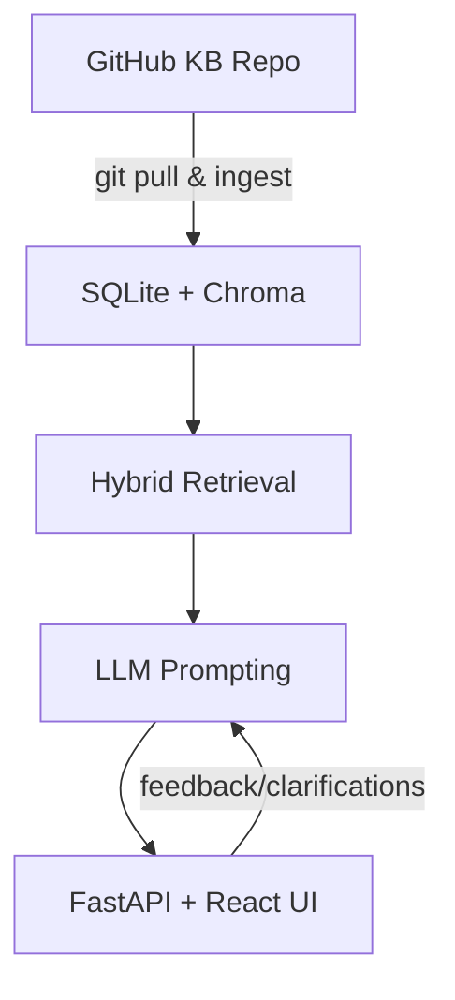

# AI-KMS Use Cases & Journeys

## 1. HR / People Operations
**Pain points:** employees unsure about leave, conduct, or payroll escalations; searching intranet is slow.
**Solution:** Ask conversational questions (“Who approves PTO longer than 10 days?”). Assistant returns the HR-002 policy, names Lina Ooi & Adrian Patel with contacts, and clarifies missing details.

## 2. Security Operations
**Pain points:** on-call SOC engineers juggling runbooks and POCs during incidents.
**Solution:** Query for response steps (“What happens for SEV1 incidents?”). Assistant cites SEC-002 and shows incident commander + legal contacts.

## 3. Finance & Travel
**Pain points:** employees guess per-diem limits or vendor process; finance gets repetitive tickets.
**Solution:** Ask “What is the hotel cap in tier-1 cities?”—assistant references FIN-001 and guides to Travel Desk contact.

## 4. IT Asset Lifecycle
**Pain points:** confusion about lost-device procedure; asset logs in different sheets.
**Solution:** “Lost my laptop—who do I inform?” returns IT-001 with IT Ops & Security POCs plus next steps.

## 5. Enablement & Messaging
**Pain points:** go-to-market teams need tone guidelines and citations quickly.
**Solution:** “What tone should we use in customer emails?” returns CO-001 with citation instructions and PMM contacts.

---
Each use case reduces ticket volume, keeps answers grounded, and surfaces the right human follow-up when automation can’t complete the task.
