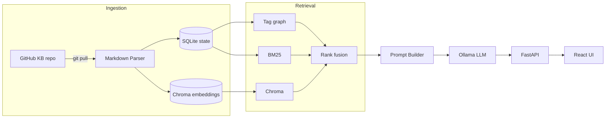

```mermaid
graph LR
    subgraph Ingestion
        A[GitHub KB repo] -->|git pull| B[Markdown Parser]
        B --> C[(SQLite state)]
        B --> D[(Chroma embeddings)]
    end
    subgraph Retrieval
        C --> E[BM25]
        D --> F[Chroma]
        C --> G[Tag graph]
        G --> H[Rank fusion]
        E --> H
        F --> H
    end
    H --> I[Prompt Builder]
    I --> J[Ollama LLM]
    J --> K[FastAPI]
    K --> L[React UI]
```
