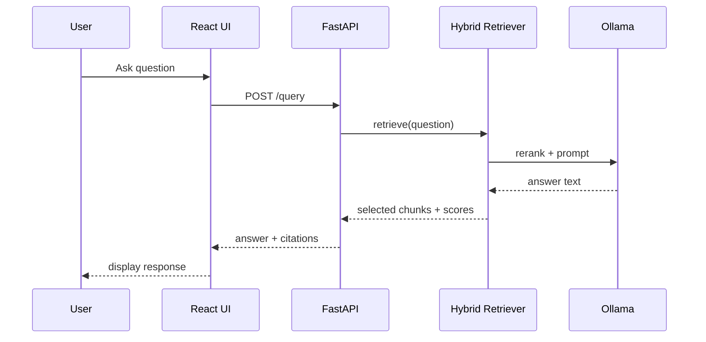

```mermaid
sequenceDiagram
    participant User
    participant UI as React UI
    participant API as FastAPI
    participant Ret as Hybrid Retriever
    participant LLM as Ollama

    User->>UI: Ask question
    UI->>API: POST /query
    API->>Ret: retrieve(question)
    Ret->>LLM: rerank + prompt
    LLM-->>Ret: answer text
    Ret-->>API: selected chunks + scores
    API-->>UI: answer + citations
    UI-->>User: display response
```
